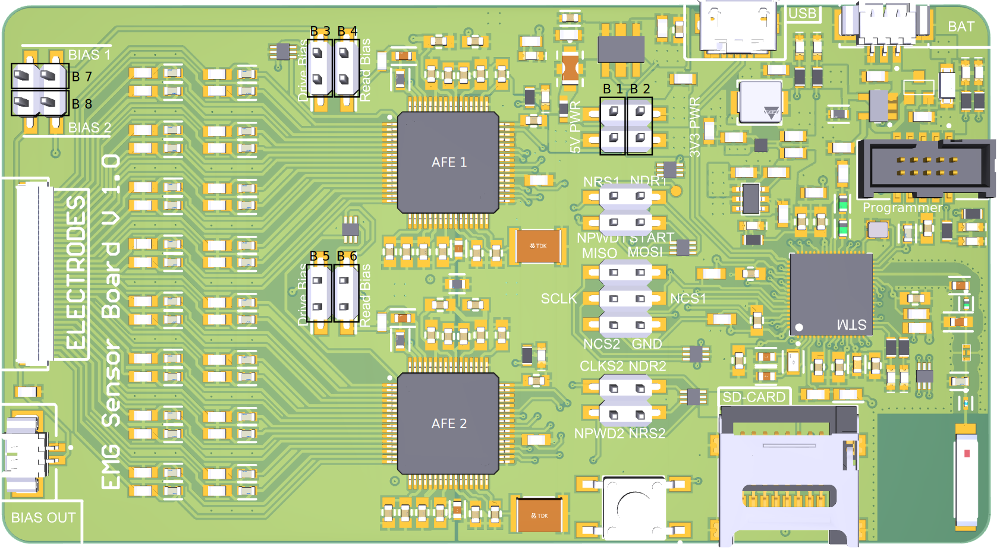
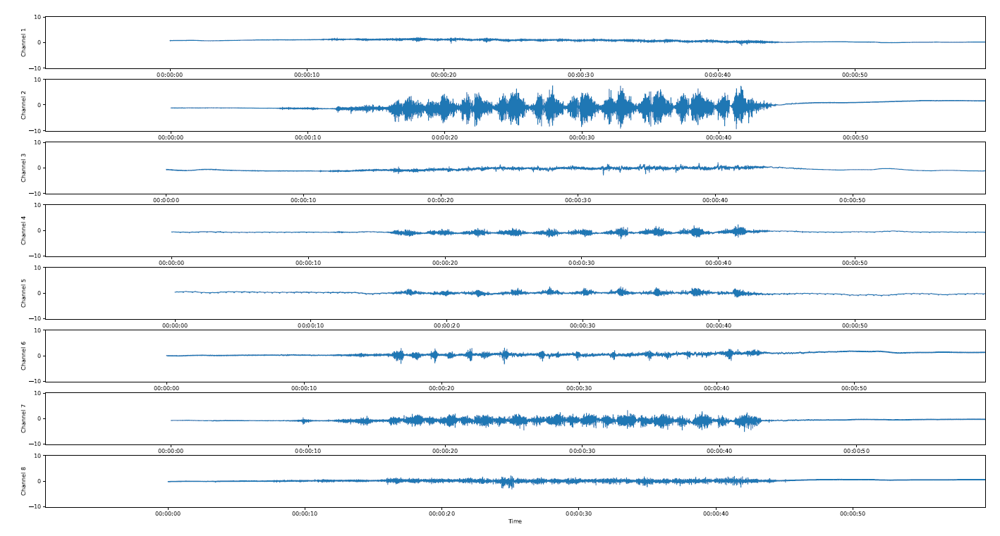
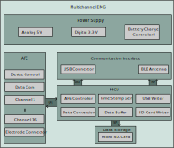

# Multichannel EMG
This is a multichannel Eelectro Myogram (EMG) sensor. The project provides hardware and driver software to conclude multichannel EMG measurements.

The system provides measurement functions for up to 16 differential EMG channels. It can be used to measurem 4x4 high density EMG grids, or 16 individual channels. The system can be operated mobile, receiving energy from a LiPo 1P1S battery, publishing the measurement data on an SD card.

**Further documentation can be found in the Wiki:**

- A description of the system hardware can be found under: [EMG Sensor Hardware Wiki](https://github.com/Robin-Geissler/EMG-Sensor-Board/wiki/EMG-Sensor-Hardware)
- A description of the system firmware can be found under: [EMG Sensor Firmware Wiki](https://github.com/Robin-Geissler/EMG-Sensor-Board/wiki/EMG-Sensor-Firmware)

**Projects related to this:**
- An audio jack electrode adapter can be fountd under: [Audio Jack Adapter](https://github.com/Robin-Geissler/EMG-Sensor-Electrode-Adapter)  
- A live visualisation software can be fountd under: [Live Visualization](https://github.com/Robin-Geissler/EMG-Sensor-Live-Plot)
- A post measurement visualization software can be found under: [Post Measurement Visualization](https://github.com/Robin-Geissler/EMG-Sensor-Plot)

Measurement data can be visualized with the provided visuaization software:

## Hardware
Anti aliasing first order lowpass filters are implemented for all channels. The measurement system uses two ADS1299 Analog Frontends (AFEs) for signal aquisistion. An STM32WB MCU is used for digital data processing. Data for live data visualization is published permanently over a USB 2.0 interface. Additionally measurement data can be stored on an on board SD card.

The system hardware can be configured over the pin header bridges B 1 to B 8.

## Firmware
The firmware is implemented on an STM32WB MCU. It performs a system configuration of the ADS 1299 ICs, runs a postprocessing pipeline, povides live data publishing over usb and saves measurement on an SD Card.

## Getting started with basic multichannel measurements
To conclude basic multichannel EMG measurents follow these steps:

1. **Configure the system hardware:** For standard operation place the pin header bridges B1, B2, B3, B7.
2. **Connect electordes to the _ELECTORDES_ connector:** The electrodes connector is a 0.5 mm pitch FPC connector on the left side of the PCB. There, it is possible to connect a 4x4 EMG grid. To conduct measurements on individual electorde pairs you can use an adapter like [this](./../../../emg-sensor-electrode-adapter), to connect audio jack based EMG electordes. Place the electrode pairs on the muscle to be measured.
3. **Connect the RLD Electrode:** Connect the RLD electrode over the _BIAS OUT_ connector in the bottom left. Place the RLD electrode on a bone aria where no muscle interferes with it.
4. **Insert an SD Card into the SD Card slot:** Due to high write speeds industrial SD Cards must be used. Make sure the SD card does not hold a file with the name LOG.csv.
5. **Power the measurement system:** Power the system either over the micro USB connector (_USB_) with 5 V, or the battery connector (_BAT_) with 3.7 V to 4.2 V. Wait for 5 seconds so the system can boot.
6. **Start a measurement:** Press the button to start a measurement. LED L1 will light up if the measurement was started. Measurement data will be conducted on all available channels and saved on the SD card.
7. **Finish a measurement:** Press the button again to finish a measurement. LED L1 will power down. Disconnecto all power supplies (USB and battery).
8. **Extract the measurement data:** Remove the SD card from the SD card slot and read it on a PC. The measurement data is saved in the file LOG.csv.
9. **Visualize the measurement data:** A visualization script like [this](https://github.com/Robin-Geissler/EMG-Sensor-Plot) can be used to visualize the measurement data.

## Trouble Shooting
Known mistakes and solutions:
- LED L3 is lid up in red while conducting a measurement. This means there was an issue with writing to the CSV File. Data was no written at all, or part of the data is missing. The following causes are known:
    1. You forgot to insert the SD card. Insert the SD card.
    2. The battery SOC is too low, which caused the processor to reduce clock speed. This resulted in the data processing pipeline beeing to slow to process measurements in realtime. Recharge the battery.
    3. A connector of the SD card holder is bent down and is not connecting to the SD card propperly. Bend it back.
- The measurement seemd to work, but the plotting of the data does not work.
    1. This happens if you conducted a measurement and there was already an existin LOG.csv file on the sd card. Or you conducted multiple measurements before plotting. All measurement runs are saved in the LOG.csv file know. Every measurement you conduct starts with the header line to be written. So you can search for the header lines in the csv file and separate the measurement data by hand, and distribute it into multiple files.
    

## License
Copyright (c) 2024 Fraunhofer EMFT

Permission is hereby granted, free of charge, to any person obtaining a copy of this software/hardware and associated documentation files (the “Software/Hardware”), to deal in the Software/Hardware without restriction, including without limitation the rights to use, copy, modify, merge, publish, distribute, sublicense, and/or sell copies of the Software/Hardware, and to permit persons to whom the Software/Hardware is furnished to do so, subject to the following conditions:

The above copyright notice and this permission notice shall be included in all copies or substantial portions of the Software/Hardware.

THE SOFTWARE/HARDWARE IS PROVIDED “AS IS”, WITHOUT WARRANTY OF ANY KIND, EXPRESS OR IMPLIED, INCLUDING BUT NOT LIMITED TO THE WARRANTIES OF MERCHANTABILITY, FITNESS FOR A PARTICULAR PURPOSE AND NONINFRINGEMENT. IN NO EVENT SHALL THE AUTHORS OR COPYRIGHT HOLDERS BE LIABLE FOR ANY CLAIM, DAMAGES OR OTHER LIABILITY, WHETHER IN AN ACTION OF CONTRACT, TORT OR OTHERWISE, ARISING FROM, OUT OF OR IN CONNECTION WITH THE SOFTWARE/HARDWARE OR THE USE OR OTHER DEALINGS IN THE SOFTWARE/HARDWARE.

